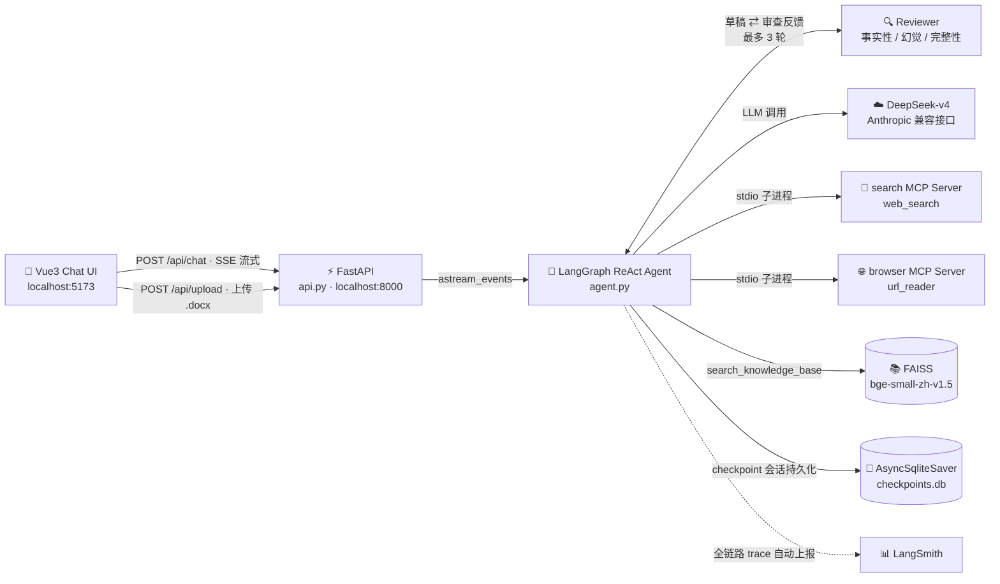
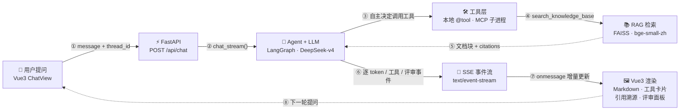

# AI Agent 对话助手

基于 **LangChain + DeepSeek** 的智能对话 Agent，具备 6 大工具调用能力、多 Agent 协作评审、RAG 知识库检索和实时联网搜索。

> 📖 完整文档：[项目概览](PROJECT.md) · [实现详解](ARCHITECTURE.md) · [前端文档](frontend/README.md)

---

## ✨ 功能亮点

- **ReAct 推理 Agent** — 自主决策何时使用工具，支持多轮对话上下文保持
- **6 大工具** — 实时时钟、数学计算器、RAG 知识库检索、联网搜索、网页阅读、Python 代码执行
- **多 Agent 协作评审** — Worker 生成回复 → Reviewer 自动审查（事实准确性 / 幻觉检测 / 完整性），最多 3 轮修正
- **RAG 知识库** — 上传 Word 文档，自动向量化（bge-small-zh），检索增强问答 + 引用溯源
- **MCP Server 架构** — 联网搜索 / 网页阅读按能力域拆分为独立 MCP Server，stdio 子进程通信
- **SSE 流式对话** — 单连接推送 token、工具调用与评审过程（按轮次批量下发，见 [Known Limitations](#-known-limitations)）
- **会话持久化** — AsyncSqliteSaver checkpointer + 前端 localStorage 双重持久化
- **LangSmith 可观测性** — 零代码接入，自动追踪全链路 LLM / 工具 / Agent 调用

---

## 📸 界面预览

| 对话主界面 | 工具调用卡片 |
|:---:|:---:|
|  |  |

| 评审面板 | 引用溯源 |
|:---:|:---:|
|  |  |

| 知识库管理 | |
|:---:|:---:|
|  | |

---

## 🏗 架构总览

### 系统架构图



### 事件流图：一次提问如何走完全链路并渲染回界面

`User → FastAPI → LLM → Tool → RAG → SSE → Vue3 渲染`：



返回路径上的 SSE 事件全部走同一条 `text/event-stream` 连接，前端按 `type` 分发：

| 事件 `type` | `step` | 前端渲染动作 |
|---|---|---|
| `message_chunk` | `llm` | 追加 token，打字机式流式输出 |
| `query_rewrite` | `rag` | 展示「查询改写」折叠块 |
| `tool_call` / `tool_result` | `tool` | 新增/收尾工具调用卡片；`search_knowledge_base` 与 `web_search` 结果额外抽取引用 |
| `review_start` / `review_result` | `review` | 追加评审条目并回填 verdict / feedback |
| `done` / `error` | `llm` / `server` | 结束 loading 态 / 渲染错误提示 |

**一条请求的链路**：前端 `POST /api/chat` → FastAPI 只传 `thread_id`（历史由 checkpointer 自动恢复）→ LangGraph ReAct Agent 推理 → 按需调用本地工具或 MCP 工具 → Worker 出稿、Reviewer 审查、不通过则带着反馈重写 → 评审通过后经 SSE 逐 token 推回前端渲染。

> 模块级架构图与完整时序图见 [PROJECT.md](PROJECT.md#整体架构)。

---

## 🛠 技术栈

| 层 | 技术 |
|---|---|
| **LLM** | DeepSeek-v4（Anthropic 兼容接口）、LangChain 1.3 |
| **Agent** | LangGraph ReAct Agent + 多 Agent 评审循环 |
| **工具** | MCP Server（stdio）+ 本地 @tool |
| **RAG** | FAISS + bge-small-zh-v1.5 Embedding |
| **后端** | FastAPI + Uvicorn + AsyncSqliteSaver |
| **前端** | Vue 3 + Vite + SSE 流式渲染 |
| **可观测性** | LangSmith Tracing |

---

## 🚀 快速开始

### 环境要求

- Python 3.10+
- Node.js 18+

### 1. 克隆项目

```bash
git clone https://github.com/leoyujao/ai-agent-assistant.git
cd ai-agent-assistant
```

### 2. 配置环境变量

```bash
cp .env.example .env
# 编辑 .env，填入你的 API Key
```

### 3. 安装后端依赖

```bash
python -m venv .venv
.\.venv\Scripts\activate        # Windows
# source .venv/bin/activate     # Linux/macOS

pip install -r requirements.txt
```

### 4. 安装前端依赖

```bash
cd frontend
npm install
cd ..
```

### 5. 启动服务

```bash
# 终端 1：后端
.\.venv\Scripts\python.exe -X utf8 start_backend.py
# → http://localhost:8000

# 终端 2：前端
cd frontend && npm run dev
# → http://localhost:5173
```

---

## 📁 项目结构

```
ai-agent-assistant/
├── agent.py              # Agent 核心（工具装配、LLM 接入、评审循环）
├── api.py                # FastAPI 后端（REST API + SSE 流式对话）
├── rag.py                # RAG 知识库（文档加载、分块、向量化、检索）
├── mcp_servers/          # MCP Server 子进程工具
│   ├── _common.py        #   safe_tool 兜底 / 截断装饰器
│   ├── search.py         #   web_search（DuckDuckGo）
│   └── browser.py        #   url_reader（网页正文提取）
├── frontend/             # Vue 3 前端
│   └── src/
│       ├── views/        #   ChatView / KnowledgeView
│       ├── components/   #   ChatMessage / ToolCard / CitationList / ReviewBlock
│       └── composables/  #   useChat.js（SSE Hook）
├── eval_runner.py        # 评估集自动运行（含 MCP 工具预检）
├── eval_scoring.py       # 评估自动评分（工具成功率 / 幻觉率）
├── requirements.txt      # 后端依赖清单（版本已锁定）
├── .env.example          # 环境变量模板
├── PROJECT.md            # 项目概览（架构、API、技术栈）
└── ARCHITECTURE.md       # 实现详解（各模块代码解析）
```

---

## 🔧 工具能力

| 工具 | 类型 | 说明 |
|------|------|------|
| `get_current_time` | 本地 | 获取当前日期时间 |
| `calculator` | 本地 | 数学表达式计算 |
| `search_knowledge_base` | 本地 | RAG 知识库检索 |
| `python_executor` | 本地 | 执行 Python 代码（进程内受限执行，**非安全沙箱**） |
| `web_search` | MCP | DuckDuckGo 联网搜索 |
| `url_reader` | MCP | 读取网页正文 |

---

## 📖 文档导航

| 文档 | 内容 |
|------|------|
| [PROJECT.md](PROJECT.md) | 架构图、API 接口、SSE 协议、技术栈、扩展指南 |
| [ARCHITECTURE.md](ARCHITECTURE.md) | 各核心模块代码解析、实现细节 |
| [frontend/README.md](frontend/README.md) | 前端组件、数据流、样式设计 |

---

## ⚙️ 配置说明

参考 [`.env.example`](.env.example) 配置环境变量：

| 变量 | 说明 |
|------|------|
| `ANTHROPIC_BASE_URL` | LLM API 网关地址 |
| `ANTHROPIC_AUTH_TOKEN` | API 认证 Token |
| `ANTHROPIC_MODEL` | 模型名称（默认 deepseek-flash） |
| `ANTHROPIC_JUDGE_MODEL` | 评估判分模型；留空则用被测模型自评，分数偏高 |
| `HOST` / `PORT` | 服务监听地址，默认 `127.0.0.1:8000`（接口无鉴权，勿轻易改 `0.0.0.0`） |
| `HF_ENDPOINT` | HuggingFace 镜像地址（国内加速） |
| `LANGCHAIN_API_KEY` | LangSmith 追踪 Key（可选，开启会上报提问与文档片段） |

---

## ⚠️ Known Limitations

这是一个**单机、单人、本地优先**的项目。下面按类别列出已知边界，包含复现路径与代码位置——它们大多是有意识的取舍，而非疏漏；写出来是为了让下一步该改什么一目了然。

### 安全边界

1. **`python_executor` 不是真沙箱**（[agent.py:226-309](agent.py#L226-L309)）。它靠「小写化后关键词黑名单 + `__import__` 模块白名单」拦截，代码仍在**同一进程、同一权限**下由 `exec` 执行：无进程隔离、无超时、无内存上限。字符串拼接（`"op"+"en"`）可绕过关键词，`getattr(os, "sys"+"tem")` 可绕过 `os.system` 字面量，`object.__subclasses__()` 可逃逸。**只防手滑，不防恶意输入**；要用于多租户需换成 subprocess + 资源限制或容器隔离。
2. **API 无鉴权、无限流**（[api.py:205-252](api.py#L205-L252)）。`/api/chat` 与 `/api/upload` 无 token 校验，CORS 仅放行 `localhost:5173`。启动脚本默认只监听 `127.0.0.1`（[start_backend.py](start_backend.py)），但把它改成 `HOST=0.0.0.0` 就等于把一个无鉴权接口交给同网段所有人，**不要直接暴露到公网**。
3. **上传无大小与数量上限**（[api.py:184-187](api.py#L184-L187)）。`await upload.read()` 将整个文件读入内存，无体积校验、无文档数上限。
4. **本地 FAISS 以 pickle 反序列化加载**（[rag.py:154](rag.py#L154) 的 `allow_dangerous_deserialization=True`）。`vectorstore/` 目录若不可信，存在反序列化执行风险。

### RAG 是评估中最弱的一环

评估中 RAG 类均分 **4.29**（全场最低），4 条幻觉用例有 2 条出自这里（见 [eval_report.txt](eval_report.txt)）：

5. **仅支持 `.docx`**（[api.py:178](api.py#L178)），不支持 PDF / txt / Markdown。分块为固定 500 字、重叠 60 的字符级切分（[rag.py:57-62](rag.py#L57-L62)），无语义分块，元数据只有文件名——**引用只能定位到文档，定位不到页码或章节**。
6. **检索无相关性阈值**（[rag.py:180](rag.py#L180)）。`similarity_search(query, k=3)` 未设 `score_threshold`，只要索引非空就几乎总会返回 3 个块，哪怕与问题毫不相关；`（未在知识库中找到相关内容。）` 分支实际上仅在索引为空时才会走到。**无关问题也会拿到 3 段上下文**，这正是 RAG 类幻觉的主要来源。
7. **重复上传不去重**（[rag.py:91-107](rag.py#L91-L107)）。同一文件再传一次会重新分块追加，无 hash 校验，检索结果里会出现近似重复块，挤占上下文。
8. **无法删除或重建单个文档**。后端没有删除接口，前端 KnowledgeView 的「×」只作用于**上传前的待选列表**（[KnowledgeView.vue:101](frontend/src/views/KnowledgeView.vue#L101)）；要移除某个文档只能清空 `vectorstore/` 后重启。

### 流式体验：事件按轮次批量下发

9. **token 不是实时推送的**。因为必须等评审跑完才能确定这版草稿就是最终答案，`message_chunk` 先缓存、直到 `_review_draft()` 返回后才一次性 flush（[agent.py:664-668](agent.py#L664-L668)）。工具事件同理——它们在该轮 `astream_events` 循环结束后才批量 yield（[agent.py:645-647](agent.py#L645-L647)）。**体感是「静默一段 → 批量出文」**：工具卡片先到、评审结果跟随、最后整段答案落地。换句话说，这里的「流式」指的是**单连接持续下发事件**，而不是逐 token 实时吐字——这是评审循环带来的必然代价。
10. **无法中断生成**。前端没有 `AbortController` 和停止按钮，后端也没有取消接口；误发的长请求只能等它跑完。
11. **只有单会话**。localStorage 用单个 key 存一组 `threadId + messages`（[useChat.js:64-66](frontend/src/composables/useChat.js#L64-L66)），只有「清空」，没有会话列表与切换。

### 并发与扩展

12. **单进程内存态，不能水平扩展**。`agent`、`_vectorstore`、`_loaded_files`、`_rewrite_cache`、`_last_sources` 全是模块级全局变量；若以 `uvicorn --workers > 1` 启动，各 worker 会各自持有一份向量库、并争抢同一个 SQLite checkpoint。
13. **并发请求的引用会串味**。引用溯源靠全局 `_last_sources` 回传：工具写入、`on_tool_end` 再读出（[rag.py:206-213](rag.py#L206-L213)、[agent.py:626-630](agent.py#L626-L630)）。两个请求同时命中 `search_knowledge_base` 时，**A 的引用可能被 B 取走**。查询改写虽也走全局 `_rewrite_cache`（[agent.py:88](agent.py#L88)），但它以查询原文为 key、用完即 pop，跨请求影响基本良性。
14. **MCP 工具每次调用都新起一个 Python 子进程**（[agent.py:397](agent.py#L397)）。stdio 模式不持有长连接，单次 `web_search` 需付解释器启动开销；装配失败则静默降级为仅本地 4 个工具（`/api/health` 报 `mcp_tools: degraded`）。
15. **评审放大延迟与成本**。最坏一次提问 = 4 轮 Worker + 4 次 Reviewer 调用（[agent.py:558](agent.py#L558)）；且 Reviewer 与 Worker **同模型自评**，不是独立裁判，存在同源盲区。
16. **评审 fail-open**。JSON 解析失败、调用异常、`llm is None` 一律返回 `pass`（[agent.py:166-170](agent.py#L166-L170)）。评审是尽力而为的增强，**不构成质量保证**。
17. **`python_executor` 无超时**，死循环会长期占住线程池线程；`redirect_stdout` 是进程级重定向，并发执行时两个任务的 stdout 可能互相污染。

### 存储与评估的局限

18. **`checkpoints.db` 无界增长**。没有 TTL、没有清理策略、没有删除会话的接口；本机这份已到 47 MB（另有 4.8 MB WAL），长期运行需手动清理。
19. **评估样本小且偏易**。50 条用例（48 条有效），hard 仅 2 条但均分只有 3.38；主力失分点就是 RAG 与强时效查询（如实时汇率）。综合均分 4.76、幻觉率 8.3%（4/48）、工具执行成功率 87.3%（69/79），且采样温度 0.7 —— **这些数字是方向性参考，不是可复现的基准**。
20. **判分方默认与被测方同源**。`ANTHROPIC_JUDGE_MODEL` 留空时，LLM-as-Judge 用的是被评测的同一个模型（[eval_scoring.py](eval_scoring.py)），会偏向自己的输出使分数虚高——上面的 4.76 分就是在这种同源判分下得到的，**配置一个独立判分模型后分数才有横向比较的意义**。

---

## 📄 License

MIT
