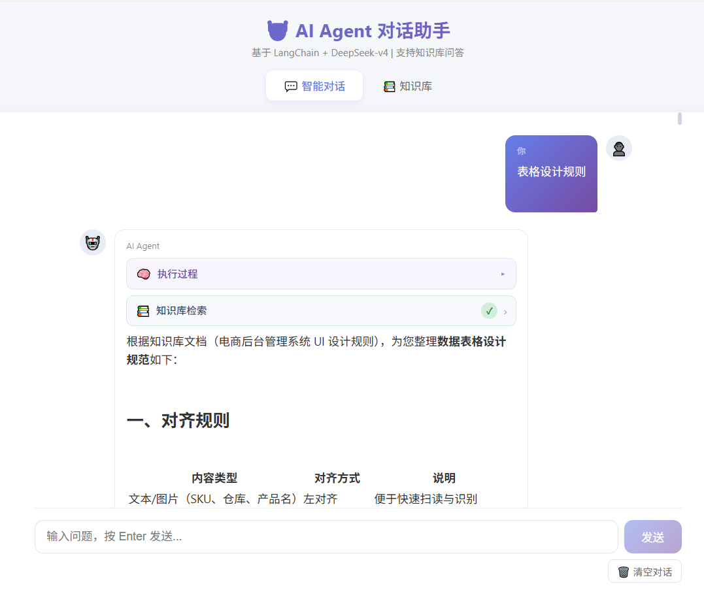
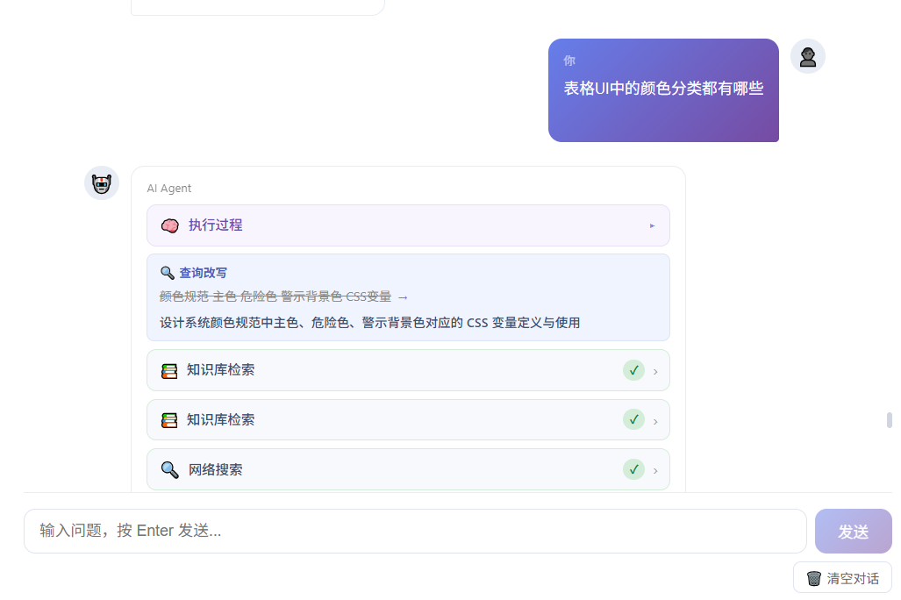
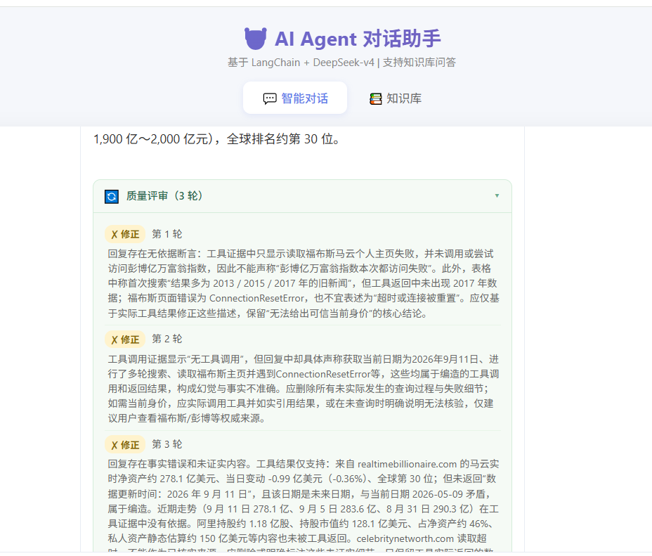
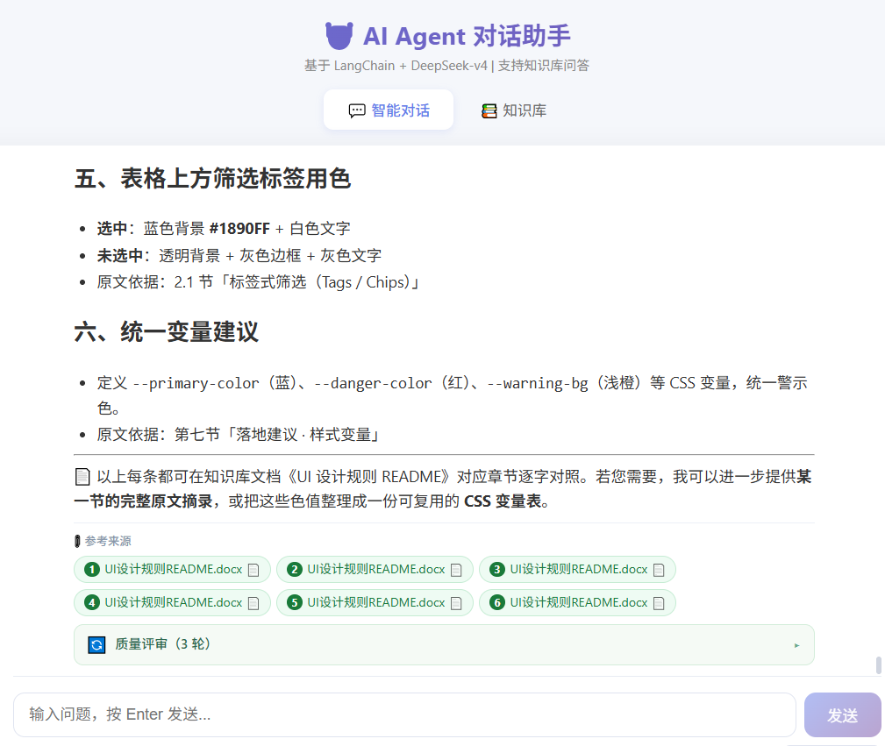
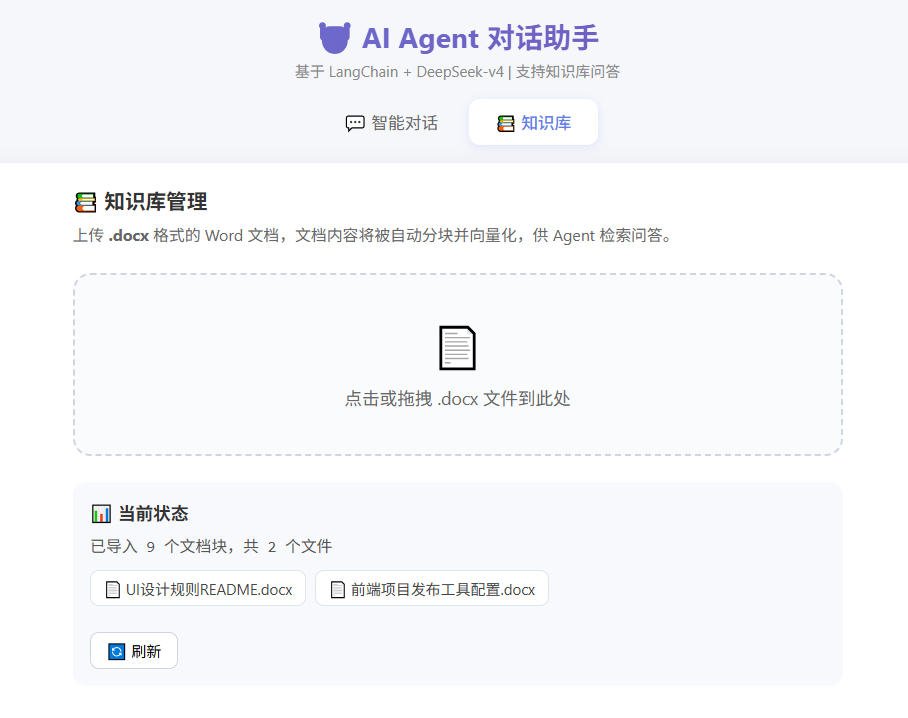

# AI Agent 对话助手

基于 **LangChain + DeepSeek** 的智能对话 Agent，具备 6 大工具调用能力、多 Agent 协作评审、RAG 知识库检索和实时联网搜索。

> 📖 完整文档：[项目概览](PROJECT.md) · [实现详解](ARCHITECTURE.md) · [前端文档](frontend/README.md)

---

## ✨ 功能亮点

- **ReAct 推理 Agent** — 自主决策何时使用工具，支持多轮对话上下文保持
- **6 大工具** — 实时时钟、数学计算器、RAG 知识库检索、联网搜索、网页阅读、Python 代码执行
- **多 Agent 协作评审** — Worker 生成回复 → Reviewer 自动审查（事实准确性 / 幻觉检测 / 完整性），最多 3 轮修正
- **RAG 知识库** — 上传 Word 文档，自动向量化（bge-small-zh），检索增强问答 + 引用溯源
- **MCP Server 架构** — 联网搜索 / 网页阅读按能力域拆分为独立 MCP Server，stdio 子进程通信
- **SSE 流式对话** — 实时 token 级推送，工具调用状态、评审过程全程可见
- **会话持久化** — AsyncSqliteSaver checkpointer + 前端 localStorage 双重持久化
- **LangSmith 可观测性** — 零代码接入，自动追踪全链路 LLM / 工具 / Agent 调用

---

## 📸 界面预览

| 对话主界面 | 工具调用卡片 |
|:---:|:---:|
|  |  |

| 评审面板 | 引用溯源 |
|:---:|:---:|
|  |  |

| 知识库管理 | |
|:---:|:---:|
|  | |

---

## 🛠 技术栈

| 层 | 技术 |
|---|---|
| **LLM** | DeepSeek-v4（Anthropic 兼容接口）、LangChain 1.3 |
| **Agent** | LangGraph ReAct Agent + 多 Agent 评审循环 |
| **工具** | MCP Server（stdio）+ 本地 @tool |
| **RAG** | FAISS + bge-small-zh-v1.5 Embedding |
| **后端** | FastAPI + Uvicorn + AsyncSqliteSaver |
| **前端** | Vue 3 + Vite + SSE 流式渲染 |
| **可观测性** | LangSmith Tracing |

---

## 🚀 快速开始

### 环境要求

- Python 3.10+
- Node.js 18+

### 1. 克隆项目

```bash
git clone https://github.com/YOUR_USERNAME/ai-agent-assistant.git
cd ai-agent-assistant
```

### 2. 配置环境变量

```bash
cp .env.example .env
# 编辑 .env，填入你的 API Key
```

### 3. 安装后端依赖

```bash
python -m venv .venv
.\.venv\Scripts\activate        # Windows
# source .venv/bin/activate     # Linux/macOS

pip install -r requirements.txt
```

### 4. 安装前端依赖

```bash
cd frontend
npm install
cd ..
```

### 5. 启动服务

```bash
# 终端 1：后端
.\.venv\Scripts\python.exe -X utf8 start_backend.py
# → http://localhost:8000

# 终端 2：前端
cd frontend && npm run dev
# → http://localhost:5173
```

---

## 📁 项目结构

```
ai-agent-assistant/
├── agent.py              # Agent 核心（工具装配、LLM 接入、评审循环）
├── api.py                # FastAPI 后端（REST API + SSE 流式对话）
├── rag.py                # RAG 知识库（文档加载、分块、向量化、检索）
├── mcp_servers/          # MCP Server 子进程工具
│   ├── _common.py        #   safe_tool 兜底 / 截断装饰器
│   ├── search.py         #   web_search（DuckDuckGo）
│   └── browser.py        #   url_reader（网页正文提取）
├── frontend/             # Vue 3 前端
│   └── src/
│       ├── views/        #   ChatView / KnowledgeView
│       ├── components/   #   ChatMessage / ToolCard / CitationList / ReviewBlock
│       └── composables/  #   useChat.js（SSE Hook）
├── eval_runner.py        # 评估集自动运行（含 MCP 工具预检）
├── eval_scoring.py       # 评估自动评分（工具成功率 / 幻觉率）
├── requirements.txt      # 后端依赖清单（版本已锁定）
├── .env.example          # 环境变量模板
├── PROJECT.md            # 项目概览（架构、API、技术栈）
└── ARCHITECTURE.md       # 实现详解（各模块代码解析）
```

---

## 🔧 工具能力

| 工具 | 类型 | 说明 |
|------|------|------|
| `get_current_time` | 本地 | 获取当前日期时间 |
| `calculator` | 本地 | 数学表达式计算 |
| `search_knowledge_base` | 本地 | RAG 知识库检索 |
| `python_executor` | 本地 | 执行 Python 代码（沙箱白名单） |
| `web_search` | MCP | DuckDuckGo 联网搜索 |
| `url_reader` | MCP | 读取网页正文 |

---

## 📖 文档导航

| 文档 | 内容 |
|------|------|
| [PROJECT.md](PROJECT.md) | 架构图、API 接口、SSE 协议、技术栈、扩展指南 |
| [ARCHITECTURE.md](ARCHITECTURE.md) | 各核心模块代码解析、实现细节 |
| [frontend/README.md](frontend/README.md) | 前端组件、数据流、样式设计 |

---

## ⚙️ 配置说明

参考 [`.env.example`](.env.example) 配置环境变量：

| 变量 | 说明 |
|------|------|
| `ANTHROPIC_BASE_URL` | LLM API 网关地址 |
| `ANTHROPIC_AUTH_TOKEN` | API 认证 Token |
| `ANTHROPIC_MODEL` | 模型名称（默认 deepseek-flash） |
| `HF_ENDPOINT` | HuggingFace 镜像地址（国内加速） |
| `LANGCHAIN_API_KEY` | LangSmith 追踪 Key（可选） |

---

## 📄 License

MIT
